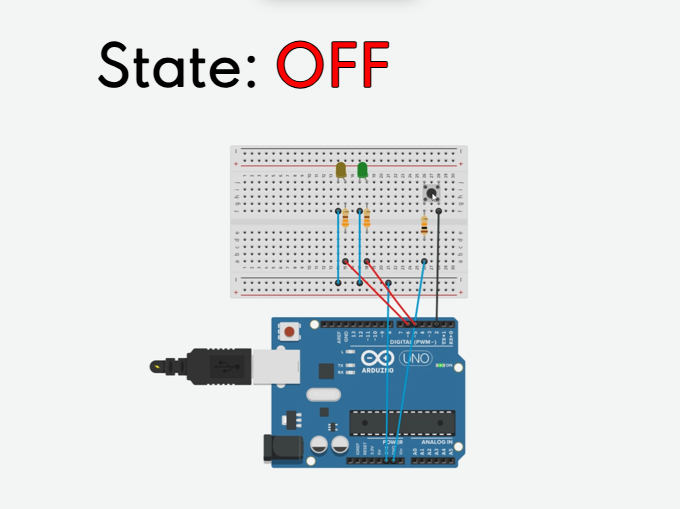
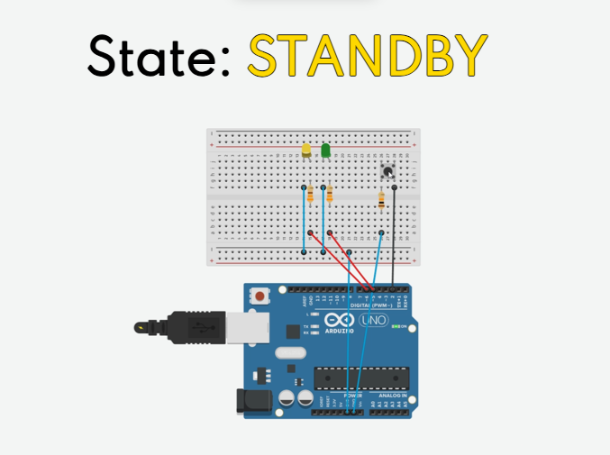
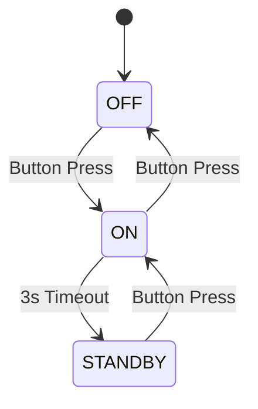
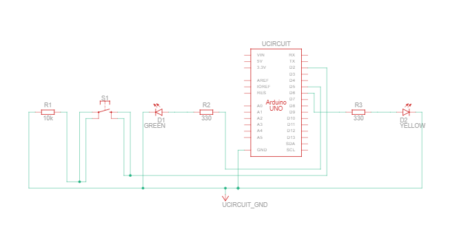

# Event-Driven State Machine on ATmega328p - Project 001
A project developed with the intention of learning baremetal embedded programming--without the *magic of Arduino libraries*. This is the first in a series of many embedded implementations, and the following is an complete overview of the project, and the process of designing it.

## What is it?
I built an Event-Driven State Machine using an Arduino UNO R3 (ATmega328p microcontroller). Of course, that is fancy jargan for a circuit that recognizes events, such as button presses, timeouts, and debouncing. In response, executes Interrupt Service Routines to change between three preset states, represented by LEDs:


|    |    |    |
|----|----|----|
|  |  |  |
| <p align="center"> Both LEDs Off</p> | <p align="center"> Green LED On </p>| <p align="center">Yellow LED On </p>  |

### State Flow:


## Hardware
This project has a straightforward architecture, which includes a simple circuit (detailed below), however, the majority of this project revolves around the software, which is written in C++11.
### The final build consists of:
- 1x Arduino Uno R3
- 2x LEDs
- 1x Button
- 3x Resistors:
	- 2x 330 Ω
	- 1x 10k Ω
- 7x Jumper Wires

### The Schematic, built in TinkerCAD: 


### An Important Nuance:
The Arduino Uno R3 has an internal pull-up resistor, which allows the pin to give off a default HIGH voltage. This is done to avoid false event readings from static electricity.

## Software
To reiterate, the software for this build is done within C++11, although is mainly using solely C syntax. Arduino IDE uses a lot of abstraction to hide the difficulty of baremetal programming on AVR; in this project, I omitted most abstractions, the only exception being memory addressing of registers--for the sake of convenience.
### Peripherals Used:
|Peripheral|Use Cases|
|-|-|
|**INT0** (external interrupt)| Detecting Button Presses |
|**Timer/Counter1** (16-bit)| Overflow Interrupt for Timeout Event |
|**Timer/Counter2** (8-bit)| Comparison Interrupt for Debouncing |
|**GPIO** (PORTD)| Detecting Input: PD2; Powering LED: PD5, PD6|

<details>
	<summary><strong>Registers Accessed:<strong></summary>

|Register Name|Use Cases|
|-|-|
|DDRD|Setting direction of PD5 & PD6|
|PORTD|Adjusting voltage output of PD2, PD5, and PD6|
|EIMSK|Enables Interrupt 0|
|TIMSK1|Enables Timer1 Overflow Interrupt|
|TIMSK2|Enables Timer2 Comparison Interrupt|
|EICRA|Bit ISC01 makes Interrupt 0 trigger on falling edge.|
|TCNT1|Set value of Timer1|
|TCNT2|Set value of Timer2|
|TIFR1|Resets Timer1 Interrupt Flag|
|TIFR2|Resets Timer2 Interrupt Flag|
|TCCR1A|Explicitly set to ensure 0x00 value|
|TCCR1B|Enables Timer1 and changes prescaler value|
|TCCR2A|Explicitly set to ensure 0x00 value|
|TCCR2B|Enables Timer1 and changes prescaler value|
</details>

### Preprocessor Directives:
In making this project, I learned about preprocessor directives, and how useful they are for embedded systems, being that they don't use excess memory. In this project, I used preprocessor directives for constants and testing:
```
//Constants
#define STANDBY_DELAY 3 //Range 1-4 seconds
#define PRESCALER 1024 //TCCR1B & TCCR2B register configs
#define TICK_RATE (F_CPU / PRESCALER)
#define BAUD 9600
#define UBRR_VALUE ((F_CPU / 16 / BAUD) - 1)

// Timer1 Config (for timeout)
#define TIMER1_START (65536UL - ((F_CPU / PRESCALER) * STANDBY_DELAY))

#if TIMER1_START > 65536UL
#error "STANDBY_DELAY exceeds 16-bit uint limit. Must be within uint16_t TCNT1 register."
#endif

//Timer2 Config (for debounce)
#define TIMER2_LIMIT 255 //OCR2A Value & Timer1 8-bit limit
#define TIMER2_DURATION_US (((TIMER2_LIMIT + 1UL) * 1000000UL) / TICK_RATE) //Timer2 duration in microseconds

//Debounce Config
#define DEBOUNCE_MS 50
#define DEBOUNCE_US (DEBOUNCE_MS * 1000UL) //miliseconds -> microseconds
#define DEBOUNCE_COUNT ((DEBOUNCE_US + TIMER2_DURATION_US - 1) / TIMER2_DURATION_US)

#if DEBOUNCE_COUNT > 255
#error "DEBOUNCE_COUNT exceeds 8-bit uint limit. Would overflow uint8_t debounce_counter in the scope of INT0 ISR."
#elif DEBOUNCE_COUNT == 0
#error "DEBOUNCE_COUNT is zero.
#endif
```

### Global Variables:
The global variables in this project were all declared using the **`volatile`** keyword, including the **`current_state`** variable of type **`State`**, which as the name implies tracks our program's state. The rest of the variables are used mostly within the context of the 3 Interrupt Service Routines.

```
//Global Variables
typedef enum { OFF, ON, STANDBY } State;

volatile uint8_t timer2_fire_count = 0;
volatile State current_state = OFF;
volatile bool button_event = false,
              timeout_event = false;
volatile uint8_t debounce_counter = 0;
```

## Features:
### Debouncing:
An accurate debounce, which prevents button from triggering unwanted interrupts. The debouncer uses Timer2 comparison mode to ensure a precise debounce:
#### Compile-time Configuration:
```
//Debounce Config
#define DEBOUNCE_MS 50
#define DEBOUNCE_US (DEBOUNCE_MS * 1000UL) //miliseconds -> microseconds
#define DEBOUNCE_COUNT ((DEBOUNCE_US + TIMER2_DURATION_US - 1) / TIMER2_DURATION_US)
```
#### Polling within ISR:
```
ISR(INT0_vect){
  if(debounce_counter == 0) {  
	...
  }
}
```
#### Debounce Counter:
To counter the short duration of Timer2 (~16ms even with highest prescaler), within the context of Timer2's comparison ISR, **`debounce_counter`** is decremented and polled. Effectively, the Timer2 interrupt is triggered repeatedly until desired debounce duration is reached.
```
ISR(TIMER2_COMPA_vect){
  if(--debounce_counter == 0){
    TIMSK2 &= ~(1 << OCIE2A); //Disable timer2 comparison ISR
    TCCR2B = 0x00; //Disables timer2
  }
}
```
### Atomic Operations:
The ATmega328p is an 8-bit chip. With the 8-bit unsigned integer limit being 255, it is easy to see why you might need to perform operations on 16-bit, 32-bit, or larger variables. However, these operations will take multiple ticks, and thus may be prone to erroneous readings and race conditions. For certain reads and writes, interrupts are disabled to ensure atomic operations.
```
// Atomically read and clear button event to prevent race conditions during polling in main.
uint8_t sreg = SREG;
cli();
bool btn_evt = button_event;
bool tmo_evt = timeout_event;
button_event = false;
timeout_event = false;
SREG = sreg;
```

## Challenges & Solutions

### Integer Overflow in Debounce Calculation
**Problem:** Debounce timing was extremely inaccurate (3+ seconds instead of 50ms)

**Root Cause:** Integer overflow in preprocessor directives
```diff
// ERROR: overflows 16-bit signed int
#define DEBOUNCE_MS 50
- #define DEBOUNCE_US (DEBOUNCE_MS * 1000)  // 50 * 1000 = 50,000 → overflow!

// SOLUTION: add UL/unsigned long suffix to int literal
#define DEBOUNCE_MS 50
+ #define DEBOUNCE_US (DEBOUNCE_MS * 1000UL)
```

 ### Register Initialization Error
 **Problem:** Standby state entered upon button press immediately after powering microcontroller.

**Expected Behavior:** OFF -> *Button Press* -> ON -> *3s Timeout Event* -> STANDBY <br>
**Actual Behavior:** OFF -> *Button Press* -> STANDBY

**Root Cause:** Residual configurations on TCCR1A register upon reset
```diff
// ERROR: TCCR1A register not explicitly reset upon Power On.
- 
// SOLUTION: Set TCCR1A register to 0000'0000
+ TCCR1B = 0x00;
+ TCCR2B = 0x00;
+ TCCR1A = 0x00;
+ TCCR2A = 0x00;
```

## Takeaways

### Technical Skills
- [x] [Direct hardware/register manipulation](#peripherals-used) 
- [x] Interrupt-driven design 🛑
- [x] Timer configuration (8-bit/16-bit, overflow/comparison)
- [x] [Atomic operations](#atomic-operations) 🕐
- [x] [Preprocessor directives in C++](#preprocessor-directives)

### What's next?

#### Workflow Improvements:
- ***Migrate to command-line toolchain*** - Transition from Arudino IDE to AVR-GCC with Makefiles.
- ***Implement strict version control*** - Make regular commits to track progress and refer to diffs more easily.
- ***Take thorough notes on bug-fixes*** - Increase retention and documentation by actively noting bugs and their fixes.

#### Learning Path: 
- ***UART Serial Monitor*** - Learn proper debugging practices.
- ***Electrical Engineering*** - Review electronic basics, and further understanding of components.
